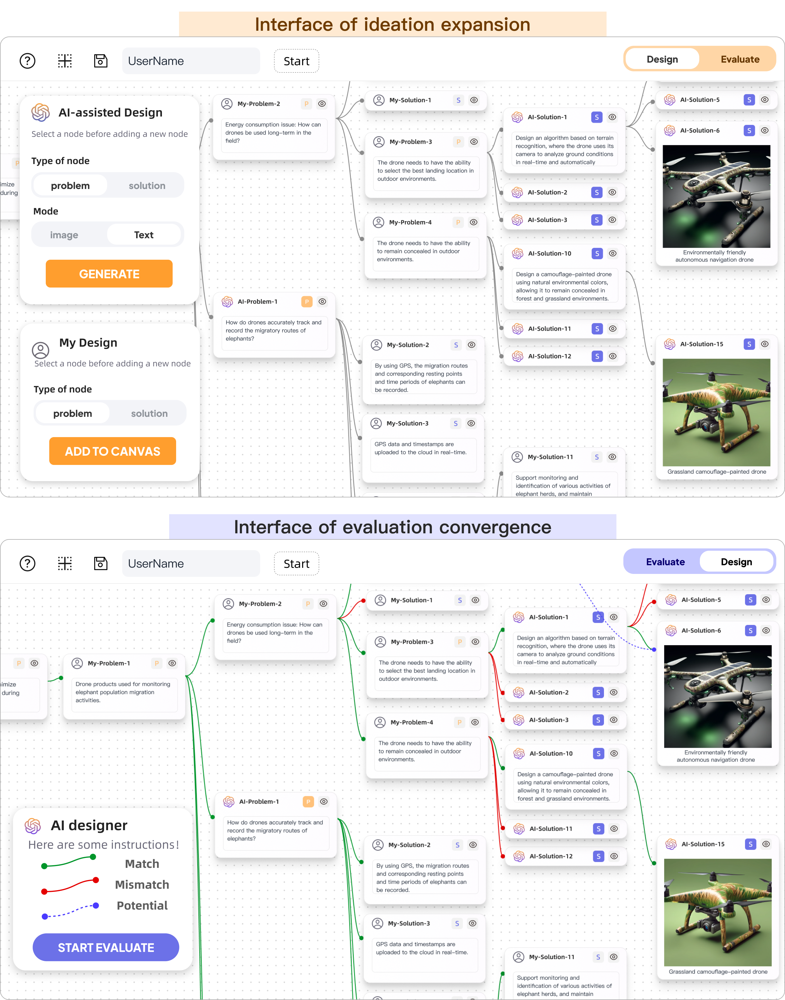
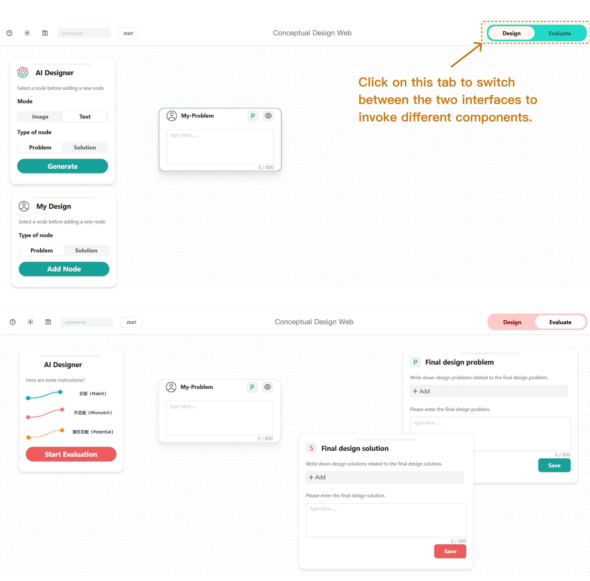

# GPSdesign

## Introduction

GPSdesign is a GenAI-supported tool that can generate multi-modal information to support creative design process, and provide decision references for the evaluation process.



## Installation

To install `GPSdesign`, follow these steps:

1. Clone the repository:

   ```bash
   git clone https://github.com/idhuohua/GPSdesign.git
   ```

2. Install dependencies of Python:

   - Enter the `GPSdesign_API` directory:
   - Set up the environment and install dependencies using Python 3:

     ```bash
     py -3 -m venv venv
     venv\scripts\activate
     ```

3. If you want to save data, enable the mongDB service, see the file `./GPSdesign_API/README.md`for details.

4. Add your API_KEY to the corresponding file of `./GPSdesign_API/config.py`

5. Run Python application:

   ```bash
   python app.py
   ```

6. Make sure you have Node.js installed.
   You can download and install the version that fits your operating system from <https://nodejs.org>

7. Install dependencies of user interface:

   - Enter the `GPSdesign_Interface` directory
   - Install dependencies using npm:

     ```bash
     npm i --legacy-peer-deps
     ```

8. Run user interface:

   ```bash
   npm start
   ```

9. Open the application in your browser.
   

## License

This project is licensed under the MIT License. See the [LICENSE](LICENSE) file for details.

## Contact

For any questions or inquiries, please contact Yexinrui Wu (<wuyexinrui@zju.edu.cn>) .
